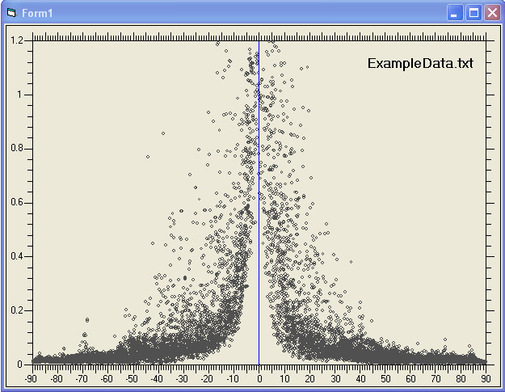



## A Graphic Class

### Description

This is a graphic draw class, it is very useful for drawing any graphic with data as given in (x,y) format. Class recognize the separator character between data points if it is comma, space and tab. It is still under construction and updated version will be uploaded as soon as available.
 
### More Info
 

             |
---                |---
**Submitted On**   |2008-02-01 23:09:44
**By**             |[Hikmet ÇAKMAK](https://github.com/Planet-Source-Code/PSCIndex/blob/master/ByAuthor/hikmet-akmak.md)
**Level**          |Advanced
**User Rating**    |5.0 (50 globes from 10 users)
**Compatibility**  |VB 6\.0
**Category**       |[Custom Controls/ Forms/  Menus](https://github.com/Planet-Source-Code/PSCIndex/blob/master/ByCategory/custom-controls-forms-menus__1-4.md)
**World**          |[Visual Basic](https://github.com/Planet-Source-Code/PSCIndex/blob/master/ByWorld/visual-basic.md)
**Archive File**   |[A\_Graphic\_2106033142008\.zip](https://github.com/Planet-Source-Code/hikmet-akmak-a-graphic-class__1-70265/archive/master.zip)

